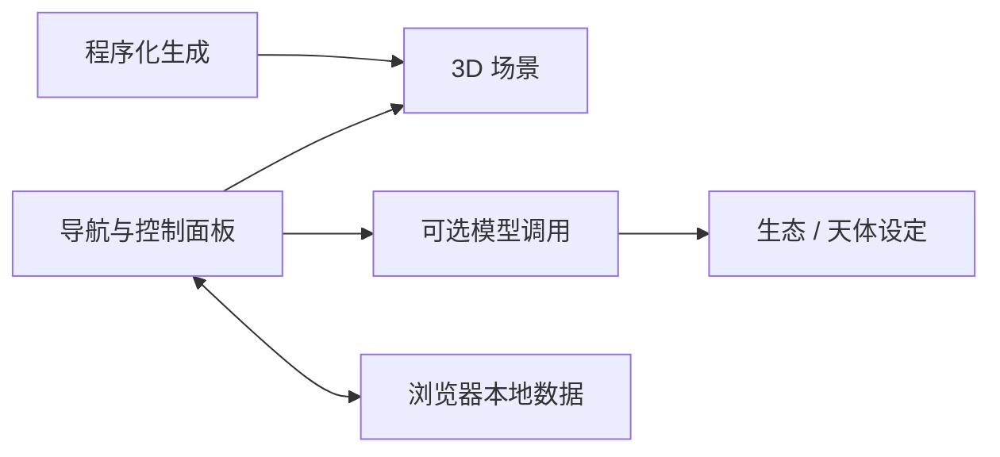

<div align="center">

# Infinite Cosmos AI · 无限宇宙

从太阳系视角出发，探索程序化天体与 AI 辅助的科幻生态设定。


[本地运行](#本地运行) · [系统结构](#系统结构) · [模型与凭据](#模型与凭据) · [使用边界](#使用边界)

</div>

使用 React Three Fiber、Drei 和 Three.js 构建的浏览器 3D 宇宙探索项目。场景、轨道、星系导航与信息面板由前端组织，Gemini 调用用于补充星球生态和新天体设定。

这是一项可视化与生成实验，不是天文观测数据库，也不是经过物理精度验证的宇宙仿真。

## 本地运行

准备与 [package.json](./package.json) 中依赖兼容的 Node.js/npm，以及支持 WebGL 的浏览器。

```sh
git clone https://github.com/alanbulan/Infinite-Cosmos-AI-.git
cd Infinite-Cosmos-AI-
npm install
npm run dev -- --host 127.0.0.1
```

[Vite 配置](./vite.config.ts) 默认端口为 `3000`，原配置监听所有网卡；上面的命令将本地开发限制在回环地址。具体地址以终端输出为准。

| 命令 | 用途 |
| --- | --- |
| `npm run dev -- --host 127.0.0.1` | 本机开发 |
| `npm run build` | 前端构建 |
| `npm run preview -- --host 127.0.0.1` | 预览已经构建的静态文件 |

`vite build` 不等于 TypeScript 全量类型检查；当前脚本没有独立测试命令。模型请求、3D 性能与浏览器适配需另外验证。

## 系统结构

| 模块 | 入口 | 职责 |
| --- | --- | --- |
| 应用编排 | [App.tsx](./App.tsx) | 场景、导航与面板状态 |
| 3D 场景 | [Scene](./components/Scene.tsx)、[OrbitSystem](./components/OrbitSystem.tsx) | 天体、轨道和渲染 |
| 导航与说明 | [GalaxyMap](./components/GalaxyMap.tsx)、[InfoPanel](./components/InfoPanel.tsx) | 星系视图与选中天体信息 |
| 程序生成 | [galaxyGenerator](./services/galaxyGenerator.ts)、[realisticSystemGenerator](./services/realisticSystemGenerator.ts) | 星系与恒星系结构生成 |
| AI 扩展 | [geminiService](./services/geminiService.ts) | 生态说明与新天体数据生成 |
| 本地状态 | [storageManager](./services/storageManager.ts)、[apiKeyManager](./services/apiKeyManager.ts) | 浏览器存储与模型配置 |



## 模型与凭据

[ApiKeyConfig](./components/ApiKeyConfig.tsx) 提供配置界面。`apiKeyManager` 优先读取浏览器 `localStorage`，再尝试开发环境注入的值；保存到浏览器不等于加密保管。

可选的开发环境变量名是 `GEMINI_API_KEY`。不要提交真实 `.env.local`，也不要用共享生产密钥构建公开网站：当前 Vite `define` 会把被引用的环境值替换进客户端代码，调用发生在浏览器中。

公开多人使用前，应另行设计服务端代理、鉴权、限额与隐私策略。代码中固定的模型 ID 不是可用性保证；失败时的信息占位也不表示真实传感器或网络设备状态。

## 使用边界

生态、生命、资源和新天体描述包含模型创造的科幻设定，不能用作真实天文结论。加载大量天体、后处理和粒子效果会增加图形开销；项目名称中的“无限”不代表无限内存、无限精度或无上限渲染能力。

原 AI Studio 模板保留在 Git 历史中。此次补齐说明没有变更源码、依赖、模型配置或部署，不新增许可证或线上验收承诺。
